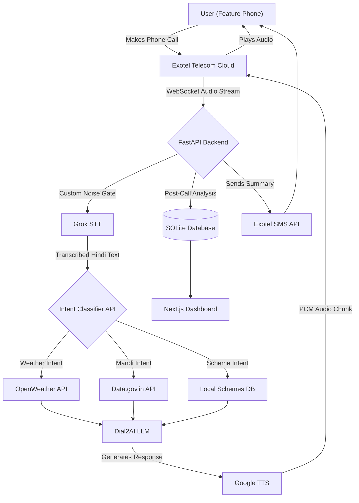

<div align="center">
  
  <h1>📞 Dial2AI</h1>
  <p><strong>Bridging the digital divide for 350+ Million Indians using AI over Phone Calls.</strong></p>
  <p><i>No Internet. No Smartphones. Just a Phone Call.</i></p>

  <h3><a href=https://drive.google.com/drive/folders/1_pD-kuckdEVDaM24y9SJjNETX6VK9By1>▶️ Watch the short Live Demo Video Here</a></h3>
</div>

---

## 🚀 The Problem & The Vision 

Artificial Intelligence is transforming lives, but its benefits are still limited to people with smartphones, reliable internet, and digital literacy, leaving millions without access.

### The Staggering Reality in India (2026):
* 📉 **350+ Million** people still use basic keypad (feature) phones.
* 🚫 **Nearly 50%** of the rural population lacks reliable internet access or digital literacy.
* 🚜 **Farmers, workers, senior citizens, and students often lack access to reliable, real-time information, making them dependent on middlemen and vulnerable to misinformation, financial loss, and missed opportunities.**

## Our Vision

If every citizen can make a phone call, every citizen should be able to use AI.

## **Dial2AI**

integrates state-of-the-art Generative AI directly into legacy telecom networks. A user calls a exotel number from a simple feature phone, and our system streams their voice via WebSockets to our AI, injecting real-world agricultural and civic data into the conversation seamlessly.

---

## ⚔️ Competitive Analysis (Why we win)

| Solution | The Problem | How Dial2AI is Better (Our USP) |
|----------|-------------|---------------------------------|
| **WhatsApp Bots / Web Apps** | Require smartphones, 4G internet, and typing literacy. Millions cannot use them. | **Zero Digital Literacy Required:** Works on a $10 Nokia feature phone via a standard GSM voice call. No internet needed. |
| **Traditional IVR Systems** | "Press 1 for Weather, Press 2 for Prices." Extremely frustrating, rigid, and limited to hardcoded scripts. | **Natural Conversational AI:** No menus. The user just speaks naturally (*"Aaj mausam kaisa hai?"*) and the AI understands intent, fetches live data, and replies. |
| **Kisan Call Centers (Human)** | Limited operating hours, massive wait times, and impossible to scale to 150M+ farmers. | **Infinite Scalability & 24/7 Availability:** AI handles thousands of concurrent calls instantly without taking breaks. |
| **Google AI Edge Gallery** | Requires expensive modern smartphones capable of running heavy on-device (Edge) AI models. | **Hardware Agnostic:** Offloads all heavy AI compute to our cloud via telecom infrastructure, making the most advanced AI accessible on the cheapest phones. |
| **Pocket Pal AI / App-based AI** | Requires the user to download an application, navigate a UI, and maintain an internet connection. | **Zero App Downloads:** No installation, no updates, no storage space required. It is as simple as dialing a phone number. |

## Why is this Unique ?

**Our Ultimate USP:** Dial2AI transforms any basic phone into an AI assistant. Users simply call a exotel number, ask questions in their preferred language, and receive intelligent voice responses powered by Generative AI and real-time data—without needing internet, an app, or a smartphone.

---

## ✨ Key Features (The Technical Magic)

We engineered Dial2AI to solve real human-computer interaction (HCI) problems over telecom:

### 🤖 Multi-Domain AI Assistant
The platform is capable of answering questions across a wide range of domains, including education, government schemes, farming, healthcare, technology, travel, jobs, finance, and general knowledge through a single voice interface.

---

### 🧠 Conversational Memory
The system remembers the ongoing conversation, allowing users to ask follow-up questions without repeating previous information.

---

### 🚫 Barge-In Interruption
The AI immediately stops speaking and listens whenever the user interrupts, enabling a natural and interactive conversation.

---

### 🌍 Multilingual Voice Support
The assistant automatically detects whether the user is speaking in English, Hindi, or Hinglish and responds in the same language for a seamless experience.

---

### 🎯 Live API Data Integration
The system fetches live weather and news data from APIs, ensuring accurate and up-to-date information.

---

### 🎙️ Smart Silence Detection
The assistant automatically detects when the user has finished speaking and instantly begins processing the request for a faster, more natural conversation.

---

### 🎵 Dynamic Music Hold
The system plays hold music while the AI prepares a response and stops it instantly when the answer is ready, ensuring a smooth experience.

---

### 🤫 Intelligent Noise Gating
The system filters background noise and telecom disturbances, ensuring only the user's speech is processed for better accuracy and conversation quality.

---

### 📝 Automatic Conversation Transcript & SMS Follow-Up
Every call is automatically converted into a text transcript and displayed in the backend terminal, which can be used to generate and send personalized SMS summaries to users after the call.

---

### 📊 Dashboard Analytics
The dashboard provides call insights, identifies the user's intent, analyzes whether the conversation was positive, neutral, or negative, and helps monitor overall interaction patterns.

---

### 📂 Shareable Call Logs
Conversation transcripts and call records can be securely stored and easily shared for future reference, reporting, and support.

---

## 🔄 The User Workflow

```mermaid
sequenceDiagram
    autonumber
    actor User
    participant Exotel
    participant Dial2AI
    participant APIs

    User->>Exotel: Dials number
    Exotel->>Dial2AI: Opens audio stream
    Dial2AI->>User: "Namaste! How can I help?"
    
    User->>Dial2AI: Asks question
    
    rect rgb(30, 40, 60)
    Note right of Dial2AI: ⚡ AI Processing Phase
    Dial2AI-->>User: 🎵 Plays hold music
    Dial2AI->>APIs: Fetches live data
    APIs-->>Dial2AI: Returns data
    end

    Dial2AI->>User: 🗣️ Speaks AI response
    User->>Exotel: Hangs up call
    
    rect rgb(40, 30, 50)
    Note over Dial2AI: 📊 Post-Call Actions
    Dial2AI-->>Dial2AI: Logs to dashboard
    Dial2AI-->>User: ✉️ Sends SMS summary
    end
```


*(Legend: Solid lines = User/System actions | Dotted lines = Background/Async events)*

---
## 🛠️ Tech Stack & Libraries
| **Category** | **Purpose** | **Technologies Used** |
|--------------|-------------|------------------------|
| 🧠 **AI & Intelligence** | Speech-to-Text, Reasoning & Analytics | Grok STT, Grok 4.1 Fast, `openai` SDK (xAI) |
| 🔊 **Voice Processing** | Text-to-Speech | Google TTS (`gTTS`), `FFmpeg` |
| ⚙️ **Backend & APIs** | Server & API Handling | Python 3.12, `FastAPI`, `uvicorn`, `httpx`, `pydantic` |
| 🔄 **Real-Time Communication** | Audio Streaming | `websockets` |
| 🗄️ **Database** | Data & Conversation Storage | `sqlite3` |
| 📞 **Telephony** | Calling & SMS Services | Exotel (Passthru Applets) |
| 💻 **Frontend** | User Interface | `Next.js 14`, `React`, `TailwindCSS` |
| 📊 **Analytics & Visualization** | Dashboard Charts | `Recharts` |
| 🎨 **Icons & UI Components** | Icons & UI Elements | `Lucide-React` |
---

## 🏗️ System Architecture

We built a highly scalable, async event-driven architecture using Python FastAPI, Next.js, and WebSockets.




## 🚧 Challenges We Ran Into (And How We Solved Them)

Building high-speed Generative AI over legacy telecom networks is incredibly difficult. Here is how we engineered our way out of the hardest HCI and networking problems:

### 1. Real-Time Voice Streaming
**Challenge:** Building a natural two-way AI conversation over a phone call with minimal delay.  
**Solution:** We used a WebSocket-based streaming pipeline to process and exchange audio in real time.

---

### 2. Latency & Dead Air
**Challenge:** Users may think the call has dropped while waiting for the AI response.  
**Solution:** We asynchronously stream an `interval.mp3` hold audio while the LLM generates its reply.

---

### 3. Live API Integration
**Challenge:** Fetching reliable real-time data from multiple external APIs.  
**Solution:** We built a modular backend that validates API responses and injects live data into the AI prompt.

---

### 4. Telecom Static Problem
**Challenge:** Phone-line noise caused the STT model to hallucinate speech.  
**Solution:** We implemented a custom amplitude gate (`get_avg_amplitude`) to filter low-level noise before transcription.

---

### 5. Echo Barge-in Challenge
**Challenge:** STT sometimes transcribed the AI's own voice as user speech.  
**Solution:** We used `playback_start_time` and echo-guard windows to ignore AI playback.

---

## 💼 Business Model

- **🏢 B2B:** AI voice assistant solutions for businesses through SaaS, licensing, and API integrations.
- **🏛️ B2G:** Partnerships with government agencies to provide AI-powered citizen services and information.

---

## 📈 Scalability

- 🌍 Supports multi-language and nationwide deployment.
- 🔗 Easily integrates new APIs and AI services.
- 📞 Built to serve millions of users through existing telecom networks.

## 🗺️ Future Improvements 

Our foundation is built. Here is how we scale to millions of users:
* 📞 **Missed Call Flow:** Users simply give a missed call and receive an automatic callback, making AI accessible without internet or a cellular data connection. Since placing a missed call does not require an active recharge, users can access the service even without a phone plan.
- 📍 **Auto-Location Detection:** Detect caller location securely to provide accurate weather and Mandi prices.
- 💬 **Bi-Directional SMS:** Users can send SMS queries and receive AI-generated replies without calling.
- 🔗 **Expanded API Ecosystem:** Integrate Agmarknet, IMD, railway, healthcare, and government datasets.
- 🗣️ **More Languages:** Add support for more regional and international languages.

---


## 📁 Project Structure

```text
dial2ai/
├── backend/
│   ├── app/
│   │   ├── routes/          # FastAPI WebSockets and REST endpoints
│   │   ├── services/        # Exotel integration, Grok API, TTS logic
│   │   └── database/        # SQLite setup and CRM logging
│   ├── .env.example         # Environment variables template
│   └── requirements.txt     # Python dependencies
├── frontend/
│   ├── src/
│   │   ├── components/      # React/Recharts UI components
│   │   ├── pages/           # Next.js CRM routes
│   │   └── styles/          # TailwindCSS globals
│   └── package.json         # Node dependencies
├── AI_WORKFLOW.md           # Our exact prompt-driven Vibe Coding methodology
├── PITCH.md                 # 3-minute hackathon presentation script
└── Readme.md                # You are here
```

## 🔧 Setup & Installation

To run Dial2AI locally for development or evaluation:

### 1. Prerequisites
- Python 3.12+
- Node.js 18+
- An [Exotel](https://exotel.com/) Account (for SIP/WebSockets)
- xAI Grok API Key

### 2. Environment Variables
Create a `.env` file in the `backend/` directory:
```env
EXOTEL_SID=your_exotel_sid
EXOTEL_TOKEN=your_exotel_token
EXOTEL_APP_ID=your_passthru_applet_id
XAI_API_KEY=your_xai_api_key
WEATHER_API_KEY=your_openweather_key
```

### 3. Run the Backend (FastAPI)
```bash
cd backend
python -m venv venv
source venv/bin/activate  # On Windows: venv\Scripts\activate
pip install -r requirements.txt
uvicorn app.main:app --host 0.0.0.0 --port 8000 --reload
```

### 4. Run the Frontend Dashboard (Next.js)
```bash
cd frontend
npm install
npm run dev
```
The CRM dashboard will be available at `http://localhost:3000`.

---

## 📞 API Reference (Lightweight)

Dial2AI exposes enterprise-ready endpoints for seamless B2B integration:

| Endpoint | Method | Purpose |
|----------|--------|---------|
| `wss://yourdomain.com/stream` | `WS` | Primary WebSocket endpoint for Exotel's Passthru Applet to stream 8kHz PCM audio. |
| `/api/leads` | `GET` | Returns JSON payload of extracted call intents and caller phone numbers for the CRM. |
| `/api/sms/webhook` | `POST` | Incoming webhook to parse bi-directional SMS queries from offline users. |

---

<div align="center">
  <i>Built with ❤️ by Team Git Push Pray for HackIndia 2026.</i><br/>
  <b>Team:</b> Rudrakshi Agarwal • Prabhav Agrawal• Sagar Jain• Niyati Suman<br/>
  <i>Licensed under the MIT License.</i>
</div>
